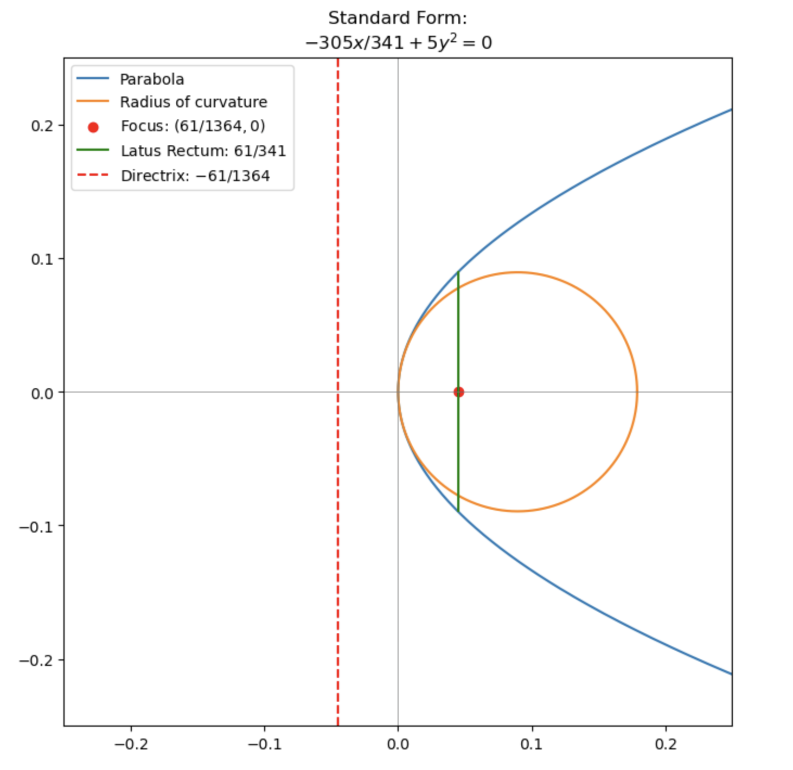

# `Conics`
### A Python class to classify, manipulate and visualise conic sections. This class is designed to extend the functionality of [`polynomial_methods`](https://github.com/pineapple-bois/polynomial-methods)

----

Conic types are instantiated from a bi-variate polynomial equation by the [factory method](https://en.wikipedia.org/wiki/Factory_method_pattern) which is a design pattern in object-oriented programming. 

We create objects to represent conic sections without having to specify the type of conic section to create. 
In this sense, [`conic_factory.py`](conics/conic_factory.py) is a classifier of conic sections. 

----

### Definition

A conic section is a plane algebraic curve of degree two whose coordinates satisfy a quadratic equation in two variables;

$$
Ax^2 + Bxy + Cy^2 + Dx + Ey + F = 0
$$

with all coefficients $\in \mathbb{R}$ and $A, B, C$ not all zero. This is the general form equation of the conic

The above equation can be written in matrix notation as

$$
\left(\begin{array}{ll}
x & y
\end{array}\right)\left(\begin{array}{cc}
A & B / 2 \\
B / 2 & C
\end{array}\right)\left(\begin{array}{l}
x \\
y
\end{array}\right)+\left(\begin{array}{ll}
D & E
\end{array}\right)\left(\begin{array}{l}
x \\
y
\end{array}\right)+F=0 .
$$

Conic sections described by this equation can be classified in terms of the discriminant $\Delta = B^2 -4AC$ of the quadratic part of the general equation, $Ax^2 + Bxy + Cy^2$.

The discriminant is $-4\Delta$ where $\Delta$ is the determinant of the quadratic matrix $\textbf{M}$,

$$
\det(\mathbf{M}) = 
\begin{vmatrix}
A & B/2 \\
B/2 & C 
\end{vmatrix}
$$

If the conic is [non-degenerate](https://en.wikipedia.org/wiki/Degenerate_conic) then, 

- if $B^2-4 A C<0$, the equation represents an ellipse.
- - if $A=C$ and $B=0$, the equation represents a circle, a special case of an ellipse.
- if $B^2-4 A C=0$, the equation represents a parabola.
- if $B^2-4 A C>0$, the equation represents a hyperbola.
- if $\tau=A+C=0$, the equation represents a rectangular hyperbola.

----

### Input Parsing and Processing: 
`Conic` takes a string representation of a polynomial equation such as, 'x^2 + y^2 -1' as input. 

Initial parsing relies on the [SymPy](https://www.sympy.org/en/index.html) library to eliminate fractions and multiply the equation by the LCM thus reducing it to the general form of a conic section with integer coefficients.

The `poly_dictionary` program then decomposes the equation into a dictionary of the form; {(degree of x, degree of y): coefficient, ...} 

----

### Example

How to create and classify a conic section. 

```python
mystery_conic = "x^2/4 + x*y/3 + y^2/9 -2*x + 3*y -1"
conic = Conic.create(mystery_conic)

# Type
In [1]: conic.type
Out[1]: Parabola

# Coefficients
In [2]: conic.coeff
Out[2]: {(2, 0): 9, (1, 1): 12, (1, 0): -72, (0, 2): 4, (0, 1): 108, (0, 0): -36}
```
The input equation represented a parabola and the output dictionary gives the coefficients of the general form equation.

----

#### Common methods

Once a conic object has been instantiated, `get_info()` is the first method to call to give an overview of the characteristics along with `plot(x_range(min, max), y_range(min, max))` 

These methods have a common name yet are uniquely defined within each subclass.

`get_info()` packages a number of useful methods and returns;
- original input string `self.__repr__()`
- type of conic `self.type`
- coefficient dictionary `self.coeff`
- general form equation
- matrices: full and quadratic `self.print_matrices`
- orientation (if applicable) `self.orientation`
- axis of symmetry (if applicable) `self.axis`
- plot `self.plot`

----

### Standardisation

Conic sections can be rotated and translated within the $(x, y)$-plane. Should a transformation occur, the state of the conic will be recorded at each stage and can be accessed with `self.print_history()`.

The aim of the transformation is to render the conic to 'standard form' where further attributes can be calculated. Directly calling these attributes is disallowed for a conic not in standard form. The user is directed to first perform a transformation.

Below is a parabola transformed to standard form



----

### Notebooks

Tutorials demonstrating the methods available to each type of conic section;

#### [Parabolas](Notebooks/Parabolas.ipynb)

#### [Circles](Notebooks/Circles.ipynb)

#### [Ellipse](Notebooks/Ellipse.ipynb)

#### Hyperbolas (work in progress)

----

### Installation

Follow these steps to install the `Conics` package:

Clone the repository:

```bash
git clone https://github.com/pineapple-bois/conic.git
```

Navigate to the cloned repository:

```bash
cd conic
```

Install the package

```bash
pip install .
```

----

### Further Development

- The Hyperbola methods are yet to be written. A hyperbola can be instantiated but will only have access to the methods of `Conic`
- Adapting `poly_dictionary` to accept radical coefficients 
- Adding additional parameters to the transformation methods to perform arbitrary translation and rotation in $\mathbb{E}^2$
- Allowing scaling and dilation
- Extensive testing is required. I plan to use `unittest`
- Writing extensive instruction and documentation
- Eliminating all floating-point error accumulation. Currently, the rotation is performed using the floating point rotation angle in radians albeit to a relatively high precision.
- Two conic objects will be allowed to 'interact' (eventually)

----